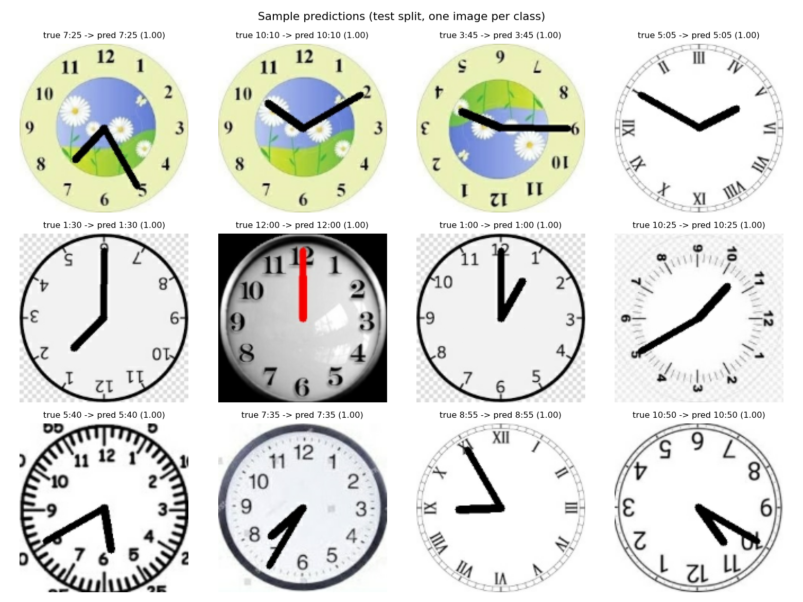
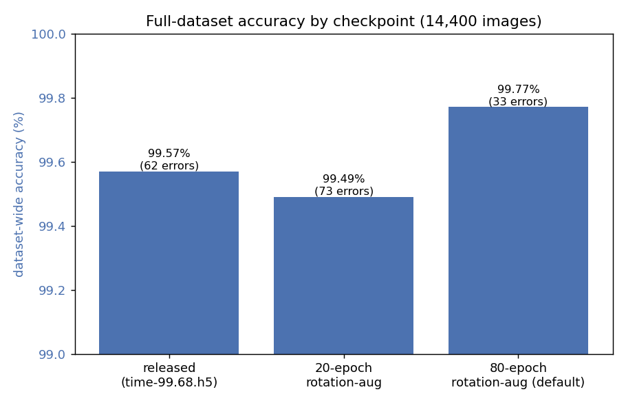
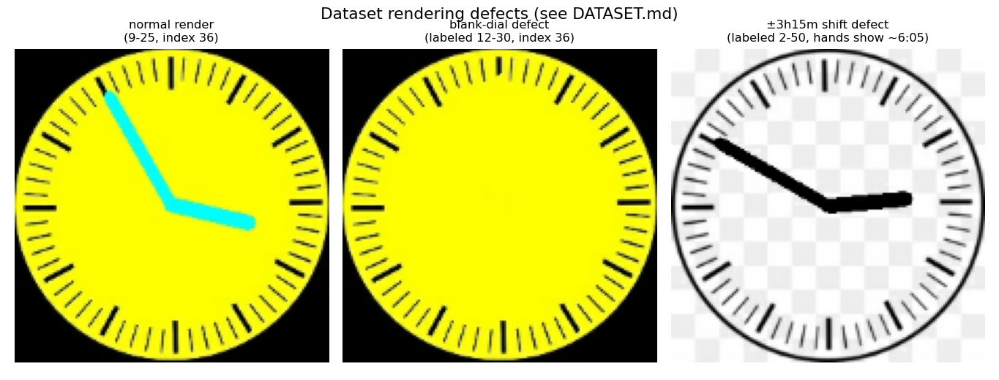
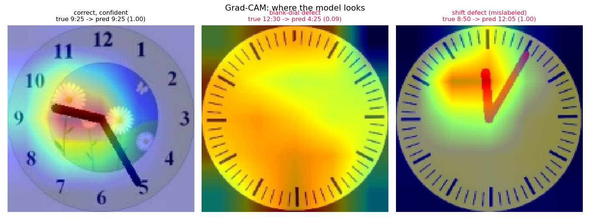
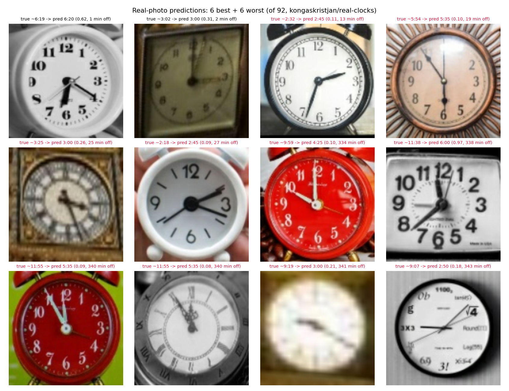
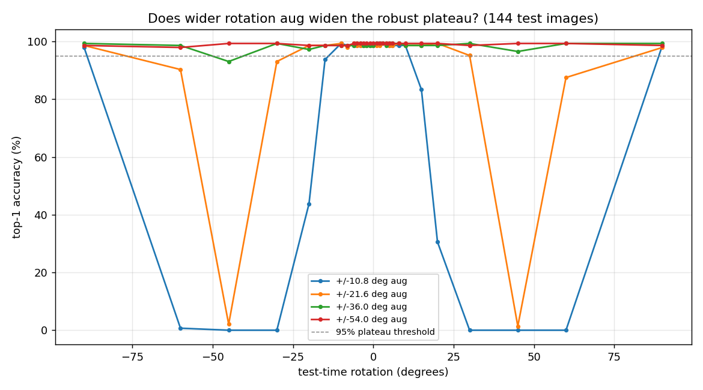
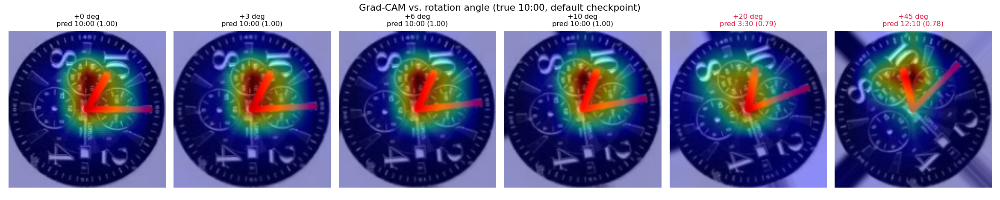

<picture>
  <source media="(prefers-color-scheme: dark)" srcset="docs/branding/logo-dark-text.svg">
  
</picture>

# Tock — analog clock reading

Reads the time off a 224×224 analog clock face image, as one of 144 classes
(every 5-minute increment on a 12-hour dial).

**[Case study →](docs/case-study.html)** (the whole story, rendered) &nbsp;·&nbsp;
brand assets in [`docs/branding/`](docs/branding/).



## Layout

```
data/
  train/ valid/ test/   144 class dirs each ("3-10", "11-45"); 11520 / 1440 / 1440 JPGs
  clocks.csv            manifest: class index, filepaths, labels, data set
  time-99.68.h5         released pretrained EfficientNetB3, Keras 2.8, Aug 2022
models/                 locally trained checkpoints; gitignored
  clock_model_rot54_s0.keras            default (see below): ±54° rotation-aug, 99.82% dataset
src/clockmodel.py       class labels, model loading, preprocessing
scripts/
  predict.py             read the time off given image(s)
  evaluate.py             accuracy + minutes-off error on a split
  train.py                retrain the same architecture from ImageNet weights
  compare_full_dataset.py compare checkpoints' per-class errors over the full dataset
  *.slurm                 GPU training jobs for this cluster
notebooks/
  eda_attention.ipynb     dataset EDA + Grad-CAM: where the model looks
```

`clockmodel.load_model()` defaults to `models/clock_model_rot54_s0.keras` if
present, falling back through `clock_model_unfrozen_aug_80ep.keras` to
`data/time-99.68.h5` (e.g. on a fresh clone before you've trained your own).
Pass `--model` to any script to override. All commands below assume you're
running from the repo root.

## Usage

```bash
python scripts/predict.py data/test/3-25/29.jpg --top 3
python scripts/evaluate.py --split test
python scripts/train.py --epochs 20 --out models/clock_model.keras
python scripts/evaluate.py --split test --model models/clock_model.keras
```

## The pretrained model

EfficientNetB3 → GlobalMaxPool → BatchNorm → Dense(256, relu) → Dropout →
Dense(144, softmax). 11,220,159 params, Adamax @ 1e-3,
categorical crossentropy. Both the released checkpoint and the locally
retrained ones below use this same architecture.

**Input is 150×150, not 224×224** — the images are 224², so everything gets
resized down. Rescaling (1/255) and Normalization are layers *inside* the model,
so feed it raw float `[0, 255]`; do not scale beforehand.

`time-99.68.h5` (released): **99.38%** top-1 on both test and valid (99.86%
top-5, mean error 1.1 min). Consistent with the `99.68` in the filename.

`clock_model_rot54_s0.keras` (default, locally trained with ±54° rotation
augmentation, `--rotation-factor 0.15`): **99.72%** top-1 test (99.86% top-5,
mean error 0.5 min); on the full 14,400-image dataset, **99.82%** (26 errors)
vs the released model's 99.57%, errors spread across many classes. It is also
**rotation-robust across the full ±90° test-time sweep** — see the rotation
section below and `CHANGELOG.md` (2026-08-28). The ±10.8° predecessor
`clock_model_unfrozen_aug_80ep.keras` scored 99.58% test / 99.77% dataset
(`CHANGELOG.md` 2026-08-23).



### Two gotchas

**1. Loading it in Keras 3 fails out of the box.** Keras 2.8 wrote a `groups`
key into every `DepthwiseConv2D` config that Keras 3 rejects. `clockmodel.load_model`
passes a subclass whose `from_config` drops it.

**2. Class order is alphabetical over the UNDERSCORE labels**, i.e.
`10_00, 10_05, …, 1_00, …, 9_55` — the model was trained from the `labels`
column of `clocks.csv`. Two wrong-looking alternatives:

- sorting the hyphenated *directory* names gives a different order, because `-`
  (45) sorts before digits while `_` (95) sorts after. This silently drops
  accuracy to **66.6%**, with every error exactly one hour off.
- the `class index` column in `clocks.csv` is ordered by hour then minute and
  matches neither. It scores **65%**.

Always take labels from `clockmodel.class_names()`.

### Known failure mode (released model, `time-99.68.h5`)

~0.6% of images misread, and most of them are the same one: class `11-10` is
confidently (p≈0.9) read as `7:55` in both valid and test. Spot-checking the
images confirms they really are 11:10 — mostly a model weakness, not a bad
label (retraining fixes all but one instance of it — see `DATASET.md`, which
turned out to be a rendering defect, not the model).

### Known failure mode

Of the default model's 26 dataset-wide errors, almost all are two dataset
rendering defects — a blank dial with no hands, and hands drawn at exactly
±3h15m from the folder's labeled time — see `DATASET.md` caveats. Real
accuracy is closer to **99.97%**. (The ±10.8° predecessor had 33 errors,
32 of them the same defects.)



## Where the model looks

`notebooks/eda_attention.ipynb` — dataset EDA (class balance, sample images
across the surprisingly wide variety of dial art styles) plus Grad-CAM
visualizations of the model's attention. Confirms visually, not just
statistically: attention concentrates tightly on the hand-tip region for
correct and confident predictions, including on the rendering-defect images —
which is what raised the question of whether those were really "model
confusion" and led to finding the ±3h15m-shift defect above. The blank-dial
defect produces diffuse, unfocused attention with low confidence instead; on
`valid/8-50/36.jpg`, attention locks onto the *actual drawn hands* (near
12:05), not the folder's claimed 8:50.



## Generalization to real photos: it does not

Every accuracy figure above is on synthetic, upright, centered,
exact-5-minute-mark renders. Tested against 92 real clock photos
(`kongaskristjan/real-clocks`, CC0) with `scripts/evaluate_real_photos.py`:
**2.2% top-1 accuracy** (vs. 99.7% synthetic), mean error 177 minutes, mean
confidence on its own top-1 guess just 0.17. Errors are spread across every
error magnitude rather than one clean systematic offset — genuine confusion
on out-of-distribution input, not a single fixable bug. **Making the model
rotation-robust (±54° default, up from ±10.8°) did not help** — real-photo
top-1 went from 5.4% to 2.2%, i.e. unchanged within noise. The gap is
perspective, dial art, lighting and framing, not rotation.

A second labelled source (`vctorsuarezvara/real-images-of-analogclocks`, 103
photos) brings the real pool to 195. `scripts/build_real_manifest.py` splits
it 138 train / 57 test (stratified by hour, seed 0); the test split is held
out of all training. **Folding the 138 training photos in and fine-tuning
from the default checkpoint (`train.py --realism-aug --real-mix
--init-weights`) roughly triples held-out real accuracy — 7% → 19%, median
error 165 → 76 min — while synthetic stays at 0.994** (`CHANGELOG.md`
2026-08-28). Realism augmentation *alone* did nothing. 19% is still not
usable; the direction (more real data) is validated but the volume isn't
there. See `CHANGELOG.md` (2026-08-24, 2026-08-28) and `DATASET.md`.



## Rotation robustness follows the training augmentation range

`scripts/characterize_rotation_brittleness.py` sweeps test-time rotation
(-90° to +90°) over 144 test images. Each checkpoint holds a flat ~99%
accuracy plateau across roughly its **literal training `RandomRotation`
range**, then falls off a cliff into a high-confidence 0%-accuracy dead zone.
`scripts/rotation_range_sweep.py` measured this across four training ranges
(`CHANGELOG.md` 2026-08-28):

| training aug | upright dataset acc | ≥95% robust plateau |
|---|---|---|
| ±10.8° (`f0.03`) | 99.71% | [−10°, +10°] |
| ±21.6° (`f0.06`) | 99.71% | [−20°, +30°] |
| ±36.0° (`f0.10`) | 99.67% | [−30°, +90°] |
| **±54.0° (`f0.15`, current default)** | **99.82%** | **[−90°, +90°] — the whole sweep** |

Widening the augmentation range widens the robust plateau to match, **at no
upright-accuracy cost** — the ±54° model is both the most accurate and the
most rotation-robust checkpoint trained. The released no-aug checkpoint has
no plateau at all.



On the narrow-augmentation checkpoints, confidence stays high (0.4–0.99)
throughout the dead zone — the model doesn't know it's wrong — and Grad-CAM
stays sharply focused on the (rotated) hands even on confidently-wrong
predictions, unlike the diffuse attention seen on the blank-dial dataset
defect above. This is confident *misreading* of a correctly-located hand
position, not lost localization. See `CHANGELOG.md` (2026-08-24, 2026-08-28).



## Testing

```bash
python -m pytest tests/ -v
```

`tests/test_clockmodel.py` has two tiers. Pure-logic tests (label formatting,
prediction decoding, the Keras 2.8→3 `DepthwiseConv2D` compat patch) always
run. Data/model-backed tests — locking down `clockmodel.class_names()`'s
ordering against both known-wrong alternatives, and a test-accuracy
regression threshold against the default checkpoint — need `data/` and/or a
trained checkpoint and skip automatically when those aren't present (e.g. in
CI, which has neither since both are gitignored).

CI (`.github/workflows/ci.yml`) runs this suite on every push/PR to `main`,
so it only ever exercises the pure-logic tier; the data/model-backed tests
are for local verification, per `AGENTS.md`'s "verify, don't assume"
guidance.

## Future work

- **Close the real-photo gap** (partly). Fine-tuning the default with the
  138 real training photos mixed in gets held-out real top-1 from 7% to 19%
  (`--realism-aug --real-mix --init-weights`, `CHANGELOG.md` 2026-08-28) —
  realism augmentation alone did nothing. Now clearly **data-bound**: 195
  photos over 99/144 classes, with the model overfitting to common times in
  the training set. The next lever is more labelled real photos (or a
  photorealistic renderer), not more tuning. Residual errors also include
  the ±195-min 12-hour-hand ambiguity, which a two-output (hour-angle,
  minute-angle) head might address.
- ~~**Model card / public-facing writeup.**~~ **Done (2026-08-28):**
  `docs/case-study.html` — a narrative pass over the whole project
  (accuracy + defect accounting, the rotation cliff and its fix, the
  real-photo wall, the "verify, don't assume" method).
- ~~**Confidence-based defect auto-flagging.**~~ **Done (2026-08-28):**
  `scripts/flag_suspects.py` flags `low-conf` (diffuse, blank-dial) and
  `confident-wrong` (sure and far off, the ±3h15m shift) predictions and
  histograms the confident-wrong signed offsets. Over the full dataset it
  catches all 26 of the default model's misreads (24 blank-dial, 2 shift)
  with no per-class work.
- ~~**Widen the rotation-augmentation range.**~~ **Done (2026-08-28).**
  Training at `--rotation-factor 0.15` (±54°) widens the robust plateau to
  the entire ±90° sweep at no upright-accuracy cost (in fact the best
  checkpoint on every axis, 99.82% dataset-wide). This is now the default;
  `clock_model_rot54_s0.keras` is the default checkpoint. Untested past
  ±54° and against real photos (see first item).
- **Confidence calibration.** All accuracy figures so far are top-1/top-5,
  not calibration — whether p=0.9 actually means ~90% correct. Relevant if
  the confidence score is ever used to decide when to trust a prediction vs.
  fall back to a human (e.g. for the real-photo axis above).
- **Model size / deployment.** EfficientNetB3 at 150×150 is a fairly heavy
  backbone for a 144-way classification task this constrained. A backbone
  ablation (2026-08-27, `scripts/train_backbone_ablation.slurm`, see
  `CHANGELOG.md`) found **EfficientNetB0 costs ~0.4–0.5 pt dataset-wide
  accuracy for 2.5× fewer params and 2× the CPU speed** —
  `train.py --backbone efficientnetb0`. MobileNetV3-Small and a 0.64M
  from-scratch CNN trade ~2–3 points of accuracy for 6–7× CPU speedup.
  B3 kept as default; seeded runs (`--seed 0`) reproduce the archived
  0.9977 baseline, so the earlier "recipe drift" was just unseeded variance.
  A **cyclic sin/cos regression head** (`--head circular`, the "better fit"
  idea) was tested and lost badly — ~21–28% exact-bucket accuracy, because
  rotation augmentation corrupts the absolute-angle target (see
  `CHANGELOG.md` 2026-08-27). Remaining: distillation; retry the regression
  head with rotation aug off + an angular loss; `--backbone resnet50v2` is
  currently broken.
